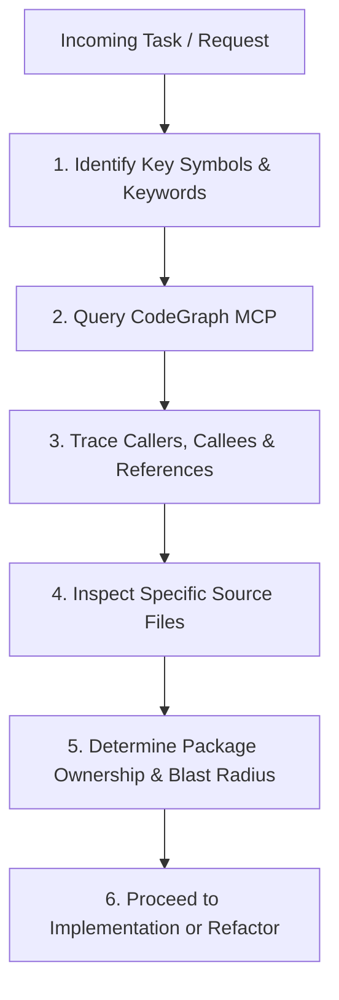

# Codebase Exploration Workflow

Use this skill whenever you need to understand unfamiliar code, trace dependencies across packages, or investigate the impact of changing a symbol or API.

## Step-by-Step Exploration Workflow

### 1. Identify Target Symbols & Entrypoints
- Determine the feature or tool name (e.g. `pdf-studio`, `collage-maker`, `batch-processor`, `use-toast`, `ImageBitmap`).
- Search for the domain types in `packages/core` or feature roots in `packages/features/src/`.

### 2. Leverage CodeGraph MCP
Use the `codegraph_explore` tool to query the symbols and examine the structural graph:
- Trace where a function/hook is consumed across `apps/web`, `apps/extension`, and `packages/*`.
- Inspect caller and callee relationships to understand data flow before making modifications.

### 3. Trace Blast Radius in Monorepo
Ask these questions before editing:
- Is this symbol exported in a package `index.ts`?
- How many packages/apps import it?
- If modifying an interface, will it break `apps/extension` while fixing `apps/web`?

### 4. Inspect Source & Tests
- Check if there are existing utilities in `packages/core` or `packages/ui` that already implement the desired functionality.
- Look for reference patterns in neighbouring tools (e.g., `packages/features/src/splitter` or `packages/features/src/splicing`).
