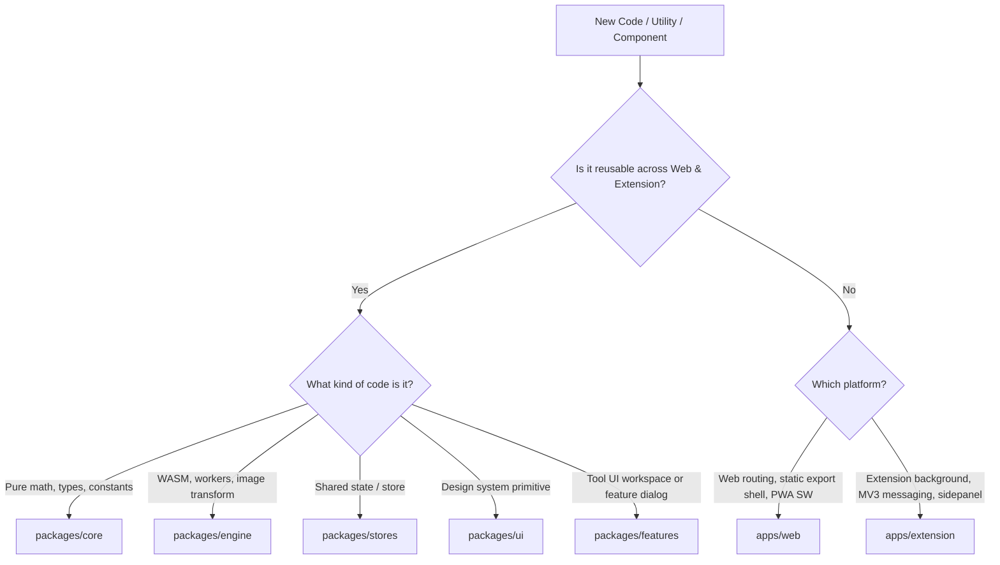

# Monorepo Navigation & Shared-First Placement

The Imify repository is structured as a shared-first monorepo. This skill guides the decision-making process for placing new code, refactoring existing logic, and maintaining parity between the Web App and Browser Extension.

## Package Ownership Matrix

| Directory | Role | What Belongs Here | What DOES NOT Belong Here |
| :--- | :--- | :--- | :--- |
| `packages/core` | Domain & Math | Pure calculations, format types, links, storage adapters, constants | React UI components, heavy DOM logic |
| `packages/engine` | Conversion Engine | WASM wrappers, worker client pools, quantizers, encoding pipelines | React UI rendering |
| `packages/stores` | State Management | Zustand global stores, state contracts, preset storage logic | Platform-specific shell layouts |
| `packages/features` | Feature Workspaces | Tool logic controllers, workspaces, tool sidebars, shared modals | App-specific routing wrappers |
| `packages/ui` | Design System | BaseDialog, buttons, inputs, cards, typography, theme helpers | Feature-specific business logic |
| `packages/i18n` | Localization | Translation dictionaries (EN/VI), `initI18n`, `useTranslation` | Hardcoded static texts |
| `apps/web` | Next.js PWA | Next.js App router pages, PWA service worker, web-header/footer shell | Reusable feature/tool business logic |
| `apps/extension` | Plasmo Extension | Options router, sidepanel experiences, background service worker | Duplicate tool engines or standalone UI |

---

## Decision Flow: Where Should My Code Go?

## Golden Rules
1. **Never Duplicate Between Apps**: If a component or function is needed in both `apps/web` and `apps/extension`, move it to `packages/features`, `packages/ui`, or `packages/core`.
2. **Preserve Parity**: Do not build a feature in Web that cannot be consumed by Extension unless explicitly restricted by platform capabilities (e.g. Sidepanel API differences).
3. **Verify Consumers**: Whenever modifying an interface in `packages/*`, always run `pnpm typecheck` to verify that both `apps/web` and `apps/extension` remain fully compliant.
