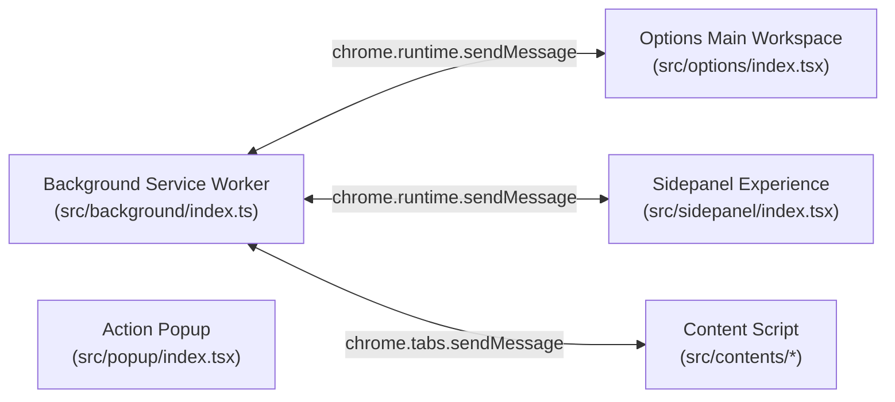

# Plasmo Extension Development Guide

This skill governs development inside `apps/extension` and any extension-specific integrations across the monorepo.

## Execution Contexts in Plasmo MV3

Always identify which execution context your code runs in before writing code:

### Context Constraints Matrix

| Context | Has DOM? | Has Canvas? | Web Workers? | File Access | Notes |
| :--- | :--- | :--- | :--- | :--- | :--- |
| **Background SW** | ❌ No | ⚠️ OffscreenCanvas only | ❌ No | `fetch()`, `FileReader` | No `URL.createObjectURL()`. Convert blobs to Base64 data URLs for downloads. |
| **Options Page** | ✅ Yes | ✅ Full Canvas / Offscreen | ✅ Yes | Full | Houses the complete Imify workstation within the extension tab. |
| **Sidepanel** | ✅ Yes | ✅ Yes | ✅ Yes | Full | Lite Inspector & SEO Audit views (Chrome/Edge only). |
| **Content Script** | ✅ Yes | ✅ Yes | ❌ Restricted | Active Tab DOM | Scans DOM images for SEO Audit and right-click context triggers. |

---

## Strict Manifest V3 Rules

1. **No Node.js Builtins**: Never import `fs`, `path`, `crypto`, or `child_process`.
2. **No `URL.createObjectURL()` in Service Worker**: Use `FileReader.readAsDataURL()` when passing blobs to `chrome.downloads.download()`.
3. **Storage Syncing**: Use `@plasmohq/storage` (`useStorage`) for UI components and `chrome.storage.local` / `chrome.storage.sync` for background scripts.
4. **Memory Management**:
   - Explicitly close `ImageBitmap` instances via `bitmap.close()`.
   - Clear canvas contexts and set unused blob references to `null` to avoid worker memory leaks.
5. **Firefox Manifest Compatibility**:
   - Firefox does not support `sidePanel` API or certain background permissions in MV3.
   - The build script `scripts/sanitize-firefox-manifest.mjs` automatically handles sanitation. When testing Firefox builds, always run `pnpm build:firefox`.
