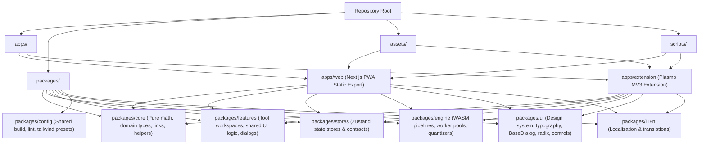

# Project Instruction

This is **Imify**, a privacy-first, 100% client-side image processing toolkit monorepo consisting of:

- **`apps/extension`**: Browser extension built with **Plasmo** (Manifest V3).
- **`apps/web`**: Standalone web app and PWA built with **Next.js App Router** (Pure Static Export).
- **License**: Apache-2.0. All dependencies and contributions must be Apache-2.0 or compatible (MIT-like).

---

## 🏛️ Monorepo Architecture

### Shared-First Philosophy: "Logic in Packages, Shell in Apps"

1. **Business Logic & UI Workspaces**: Live in `packages/features` and `packages/ui`.
2. **Platform Shells**: `apps/web` and `apps/extension` provide shell routing, navigation layout (`WorkspaceLayout`), and platform adapters.
3. **Parity Enforcement**: Always prefer porting/moving reusable logic into shared packages (`packages/*`) over duplicating logic in app directories.

---

## ⚙️ Development Workflow

### Before Modifying Existing Code:

- **Inspect Related Implementations**: Search existing tools and packages to avoid reinventing patterns.
- **Use CodeGraph MCP**: Run `codegraph_explore` to inspect symbol callers, callees, and dependencies across the monorepo.
- **Check Execution Context**: Distinguish between Next.js (Server vs. Client Component) and Extension (Background Service Worker, Options, Sidepanel, Content Script).
- **Memory & Resource Safety**: Always handle `OffscreenCanvas`, `ImageBitmap` lifecycle explicitly (`bitmap.close()`, variable cleanup) to prevent tab OOM crashes.

### After Modifying Existing Code:

- Run `pnpm sync:assets` if shared assets, illustrations, or WASM files change.
- Run `pnpm sync:locales` if translation keys change in `packages/i18n`.
- Run `pnpm sync:credit` if libraries, licenses, or attributions change.
- Run `pnpm sync:package` if `package.json` versions or FAQs change (auto-generates `FAQs.md`).

### Testing & Verification:

- For any code changes: Run `pnpm typecheck` to verify TypeScript across all 9 packages (or target any package for smaller scope) and `pnpm lint` to check code quality.
- For major web refactors: Run `pnpm build:web` to verify Next.js static production export.
- For extension changes: Run `pnpm build:chrome` or `pnpm build:firefox` to verify extension builds and manifest sanitation.
- Giving commit message if it is required in the prompt.
