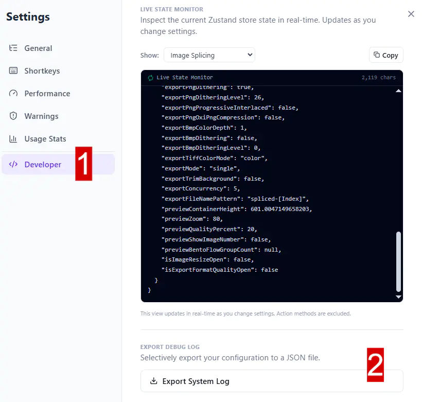

### Added

- **Image Splitter Workspace:** Added a dedicated `Image Splitter` tab directly below `Image Splicing` with full preset workflow and batch split export.
  
  - New splitter preset lifecycle (`select` / `workspace`) with default preset auto-bootstrap and breadcrumb path: `Image Splitter > {PresetName}`.
  - New splitter workspace with multi-image queue, drag-and-drop import, drag-and-drop reorder strip, dimension mismatch warnings, active-image highlight + preview switcher, and split-plan overlay preview.
  - Canvas interaction parity update:
    - Added `Zoom / Pan / Idle` interaction modes with shortcut integration and `Idle` as default mode.
    - Added resizable canvas height behavior and preserved preview height when switching active image.
    - Fixed preview grid r
    - Added direct visual guide adjustment in `Basic` mode by dragging the first guide on each axis from canvas overlay.
  - Split options workflow redesign:
    - `Mode` control migrated to segmented button UI.
    - Added guide color customization
    - Direction fallback warnings now use compact chip + tooltip style instead of inline messages.
    - Added centralized splitter tooltip source and expanded method guidance for both `Basic Method` and `Advanced Method`.
  - New split configuration card with `Basic` and expanded `Advanced` methods:
    - Basic: `Count`, `Percent`, `Pixel`.
    - Advanced: `Pixel Pattern`, `Percent Pattern`, `Custom List`, `Color Match`, `Social Carousel Slicer`, `Gutter & Margin Grid`, `Auto Sprite Extractor`.
    - Direction and ordering controls for deterministic segment traversal, with method-aware auto/hide behavior when applicable.
  - New `Color Match Rules` card (conditional, only shown when Advanced + Color Match) with per-rule color target, tolerance, offset, skip-before, break-after, safe-zone variance search, and match mode configuration.
  - New advanced split method implementations:
    - `Pixel/Percent Pattern`: dedicated accordion with reorderable guide sequence list via DnD.
    - `Custom List`: dedicated accordion with reorderable guides, per-guide unit (`pixel/%`) and edge-origin controls.
    - `Social Carousel Slicer`: target ratio based slicing with auto direction detection and overflow strategies (`crop`, `stretch`, `pad`).
    - `Gutter & Margin Grid`: grid slicing by rows/columns with margin, gutter, and remainder distribution controls.
    - `Auto Sprite Extractor`: alpha-island component detection with configurable alpha threshold, connectivity, min area, padding, and sort order.
  - New standardized sidebar wiring for splitter using `WorkspaceConfigSidebarPanel` (reorderable cards + responsive two-column layout on wide sidebars).
  - New shared export controls in splitter sidebar:
    - `Export Format & Quality`
    - `Format Advanced Settings`
    - Export split-button flow with `Download ZIP` primary action and `One by one` option + file count hint.
    - Integrated large-download confirmation flow for one-by-one mode with threshold-based warning dialog.
    - Export ordering and file renaming moved to dedicated export settings flow; removed legacy inline download mode selector.
  - Added splitter processing pipeline under `src/features/splitter/`:
    - split planner/engine (`count`, `percent`, `pixel`, `pixel/percent pattern`, `custom list`, `color match`, `social carousel`, `gutter-margin grid`, `auto sprite extractor`)
    - segment cropping + codec conversion integration
    - ZIP packaging helper for batch downloads.
  - UX feedback and robustness updates:
    - Import and export progress now use toast-based status flows (processing/success/error) instead of inline status text.
    - Added contextual visual-help tooltip near splitter workspace title (Basic mode) with instructional video preview.
    - Fixed clickable overlap issues in image strip actions, focus-loss regression in dynamic pattern inputs, and passive wheel listener warnings in canvas interaction.
    - Added defensive normalization guards for persisted splitter settings (guide color/custom guides/new advanced settings) to prevent runtime crashes with older saved states.

- **Pattern Generator Workspace:** Added a dedicated `Pattern Generator` tab directly below `Image Filling` in the Options navigation with a full, independent pattern design workflow.
  
  - New live preview workspace with canvas-safe rendering and boundary guide overlays.
  - New Canvas card for width/height control, preset size picker integration, and background modes (`Transparent`, `Customized Color`, `Image`).
  - New Assets card with:
    - Upload support for bitmap/vector image files (including SVG)
    - Built-in drawing dialog (`Draw Asset`) to create transparent PNG assets directly in-browser
    - Layer-style ordering with drag-and-drop (`dnd-kit`), visibility toggles, and per-asset opacity control.
  - New Pattern card with full distribution controls (density, spacing, jitter, scale variance, random rotation, seed) plus `Edge Behavior` modes:
    - `Clip`
    - `Strict Inside`
    - `Center Inside`
  - Added configurable Inbound/Outbound boundary controls (rectangle/ellipse with position, size, rotation) for pattern placement masking/culling behavior.
  - Added full export stack for Pattern Generator using shared codec pipeline (JPG/MozJPEG/PNG/WebP/AVIF/JXL/BMP/TIFF), including:
    - Shared Export Format & Quality + Advanced codec settings cards
    - Dedicated worker-based export renderer/encoder with progress updates and inline fallback path.

- **Fill Session Template Isolation:** Fill Mode now works against a session-only cloned template instead of mutating the original template reference.
  
  - Layer reorder, move, rotate, stretch, and Fill-delete/hide actions are now applied to the Fill session copy only.
  - Fill export now renders from the active session copy (including hidden layer filtering), while the original template remains unchanged.

- **Customizable Shortkeys System:** Added configurable keyboard shortcuts with reusable shortcut infrastructure and settings UI.
  
  - New **Shortkeys** tab in Settings with grouped action list, live rebinding, clear/reset per action, reset-all, and conflict hints (scoped by workspace).
  - New shared shortcut modules for definitions, normalization, matching, formatting, storage, and runtime registration hooks.
  - Fill and Image Splicing preview mode shortcuts now use configurable bindings; Fill customization tab switching shortcuts are also configurable.
  - Preview mode toggles now display dynamic key hints from current shortcut preferences.

- **Image Filling Export Standardization:** Filling Export now reuses the same shared Export Format & Quality card + Advanced Settings group pattern used in Single/Batch workflows.
  
  - Replaced custom/basic Fill export controls with shared `TargetFormatQualityCard` and `FormatAdvancedSettingsCard` wiring.
  - Removed PSD from active Fill export UI for now (kept deferred for a later dedicated implementation pass).
  - Filling raster export pipeline now routes through shared raster adapter encoding, so AVIF/JXL/MozJPEG/WebP/PNG/BMP/TIFF options are honored consistently (including PNG tiny/oxi and format-specific advanced settings).

- **Image Filling Template Creation UX Refresh:** Reworked the Filling template creation flow into a single, more visual dialog.
  
  - Unified flow now follows: Template Name -> Canvas Size -> Creation Method (no step-switching between dialogs).
  - Canvas Size section now focuses on manual input controls only (width, height, unit, DPI) with a dedicated "Popular Sizes" trigger.
  - Added a reusable popular-size picker dialog grouped by Paper, Social, and Screen categories for future reuse.
  - Creation Method now uses compact `RadioCard` selection with icon + title + subtitle for clearer scanability.

- **Image Filling Manual Editor Parity Update:** Manual Add/Edit workspace is now aligned with Fill interaction patterns.
  
  - Added Fill-style preview controls in Manual Editor: resizable preview height, Zoom/Pan/Idle interaction modes, and shared shortcut bindings (`fill.preview.*`).
  - Manual layer list now uses DnD toolkit reordering (same pattern as Fill), replacing move up/down controls.
  - Added a new Canvas accordion in Manual sidebar with direct size editing (width/height/unit/DPI) and integrated Popular Sizes dialog.
  - Corner resize now supports temporary ratio unlock when holding `Ctrl`, enabling stretch behavior during manual transform.

- **Preset Detail Cards & Info Panel Redesign:**
  
  - New preset detail cards in select view showing format, quality, resize settings (Single/Batch) and layout, spacing, export format (Splicing).
  - Info panel redesign across Single Processor, Batch Processor, and Image Splicing with Context Menu-style layout: icon + title + description sections for visual consistency.
  - Detail cards display key preset configuration in compact, readable format with light background separation.

- **Image Splicing Preset Workflow:** Expanded Image Filling-style preset system to Image Splicing processor:
  
  - New `SplicingPresetStore` (Zustand + persist) for managing saved splicing presets with full layout/export config snapshots.
  - New splicing preset select view with card-based UI (create/edit/delete actions, highlight color indicator, updated date display).
  - New splicing sidebar shell with mode-aware info panel (INFORMATION title) for both select and workspace modes.
  - New splicing workspace shell with breadcrumb integration (`Image Splicing > {PresetName}`), default preset auto-bootstrap, and async config sync.
  - Reuses shared UI components (FeatureBreadcrumb, WorkspaceSelectHeader, SavePresetDialog) for consistent cross-feature UX.

- **Target Format Options (Single Source of Truth):** Added `src/options/shared/target-format-options.ts` to centralize selectable target formats, labels, and canonical extension display used by context-menu and shared setup cards.

- **Watermark Library (Save/Open in Watermark Dialog):** Added dedicated watermark pattern management in the Watermarking dialog:
  
  - New `Save` and `Open Saved` actions next to `Reset`.
  - New BaseDialog-powered `Open Saved Watermark` flow with grid cards (name, saved date, preview), selection, open, and delete actions.
  - New BaseDialog-powered `Save Watermark` flow with `Save as new` and `Overwrite existing` actions.
  - Overwrite flow now supports selecting a saved watermark target first, then auto-filling editable name before saving.
  - Watermark dialog sublabel now appends `Saved` when current watermark matches a saved pattern.

- **Processor Preset Workspace Shell (Single/Batch):** Added Image Filling-style preset workflow shell for `Single Processor` and `Batch Processor`:
  
  - New preset selection screen with card-based open/edit/delete and `New Preset` flow.
  - New select-mode sidebar info accordion; workspace sidebar switches back to full processor configuration once a preset is active.
  - New global header breadcrumb integration using `Single Processor > {PresetName}` / `Batch Processor > {PresetName}`.
  - New per-context persisted workspace state (`workspace` vs `select`) and active preset id tracking.
  - First-time bootstrap now auto-creates a `Default Preset` (blue highlight) and enters workspace mode.

- **Shared Workspace UI Primitives:** Extracted reusable components for cross-feature workflow consistency:
  
  - `FeatureBreadcrumb` for root + active entity breadcrumb rendering.
  - `WorkspaceSelectHeader` for selection-page title/create action rows.
  - `WorkflowInfoAccordion` for feature info cards in select-mode sidebars.
  - Image Filling now reuses these shared primitives (breadcrumb, select header, info accordion) to align behavior with Single/Batch flows.

- **Context Menu Global Formats (Target Card Integration):** Added per-format `Export Format & Quality` accordion controls directly inside active global format cards.
  
  - Applies to built-in global cards from `JPG` through `TIFF` (with `PDF` remaining informational/no extra target controls).
  - `JPG` card now supports switching target behavior between standard JPG and MozJPEG mode in the same card.
  - Reuses the same codec-option wiring model used in Single/Batch processor flows (quality, AVIF speed, WebP lossless tuning, PNG tiny+dithering, BMP depth+dithering, TIFF mode, ICO sizes/toolkit options).

- **Extension Command Center Popup:** Replaced the default toolbar click behavior with a dedicated popup workspace (English UI, dark/light friendly) exposing quick extension actions:
  
  - `Page Scanner / SEO Audit`
  - `Side Panel Lite Inspector`
  - `Feature List / Settings`

- **SEO Auditor (Policy-safe DOM Scanner):** Added a new `src/features/seo-audit/` slice that scans active page `img` and CSS `background-image` assets and returns audit-only diagnostics:
  
  - Accessibility and SEO signals (missing alt, lazy-load opportunities, oversized assets, insecure URLs).
  - Lightweight transfer-size and potential-savings estimation for optimization planning.
  - Risk score (`Healthy`, `Needs Work`, `Critical`) and actionable recommendation list.
  - Explicit policy note positioning Imify as a diagnostic tool (no bulk download workflow).

- **Side Panel Lite Inspector:** Added lightweight side panel app (served via options view mode) with:
  
  - Drag-and-drop image intake as primary entry interaction.
  - Embedded inspection cards aligned with core Image Inspector sections (File Information, Dimensions, Date & Time, Color, Metadata).
  - Inline SEO Audit Snapshot display populated by popup scan action.

- **Content Script SEO Listener:** Added dedicated content listener to handle popup scan requests and return typed audit reports.

- **Image Filling Feature:** Full implementation of the Image Filling pipeline accessible via the new "Image Filling" tab in the sidebar navigation.
  
  - **Template Selection [B]:** Grid view of saved templates with sort (by usage, date, name), pin-to-top, edit, and delete actions. Templates are persisted in a dedicated IndexedDB database (`imify-filling-storage`).
  - **Template Creation [E] - Canvas Size Dialog:** Presets for paper sizes (A3-Legal), social media (YouTube, Facebook, Instagram, Twitter), and screen resolutions (720p-4K) with custom dimensions and unit conversion (px, in, cm, mm).
  - **Template Creation [E] - Manual Editor:** Konva-based interactive canvas with shape layers (rectangle, square, circle, triangles, parallelogram, rhombus, pentagon, hexagon, star). Supports drag, resize, rotate via Transformer, layer list with lock/visibility/delete/reorder, and per-layer property controls (position, size, rotation).
  - **Template Creation [E] - Layer Groups:** Group multiple layers with boolean operations: close loop (connect last layer to first) and fill interior (treat enclosed area as solid).
  - **Template Creation [E] - Symmetric Generator:** 13-parameter parallelogram layout engine for generating grid patterns with configurable axis direction, count, spacing, angles, and offsets. Includes bounding box culling to remove off-canvas shapes.
  - **Image Fill [C]:** Konva workspace with per-layer image upload, clipping masks, and direct manipulation of image position/scale/rotation within each shape. Supports per-layer border (width, color) and corner radius (bezier-approximated). Canvas background options: transparent, solid color, gradient, image. Global border and corner radius overrides.
  - **Export [D]:** Raster export using `OffscreenCanvas` with `Path2D` + `clip()` for clipping masks. Supports PNG, JPEG, WebP, AVIF, JPEG XL, MozJPEG, BMP, TIFF formats with quality control. PSD export via `ag-psd` with each template layer mapped to a PSD layer.
  - **New dependencies:** `konva` + `react-konva` (MIT) for canvas scene graph, `ag-psd` (MIT) for PSD export.

- **Image Inspector Interactive Preview:** Upgraded preview to support advanced visual diagnostics:
  
  - Pixel-level eyedropper with live HEX/RGB/Alpha readout and coordinates.
  - Loupe magnifier overlay with adjustable zoom level.
  - Preview channel modes (`All/R/G/B/Alpha`) and color-blind simulation (`Protanopia`, `Deuteranopia`, `Tritanopia`) for accessibility-oriented QA.

- **Image Inspector Web Performance Advisor:** Added smart optimization diagnostics with:
  
  - Automatic risk scoring (`Good`, `Needs Work`, `Poor`) and actionable payload suggestions.
  - In-preview histogram analysis (luminance + RGB curves) with shadow/highlight clipping indicators.
  - Format-aware recommendations (e.g., PNG-without-alpha -> WebP/MozJPEG).

- **Image Inspector -> Single Processor Bridge:** Added `Optimize Now` flow from Inspector advice panel:
  
  - Transfers current inspected file into Single Processor.
  - Applies recommended target format before navigation for faster optimization workflow.

- **Image Inspector WCAG Auto Pair:** Added automatic best-contrast palette pairing preview with WCAG level badge (`AAA`, `AA`, `AA Large`, `Fail`) and contrast ratio summary.

- **Resize Advanced Resampling:** Added `Resampling Algorithm` selector to shared `ResizeCard` (Custom Format + Single/Batch setup flows) with options: `Browser Default`, `Lanczos3`, `Magic Kernel`, and `HQX`.

- **Resize Local WASM Workflow:** Added local-only resize WASM asset sync pipeline for `@jsquash/resize`:
  
  - New `scripts/sync-resize-wasm.mjs` script and `sync:resize-wasm` package command.
  - Included in aggregate `sync:wasm` workflow.
  - Synced assets: `squoosh_resize_bg.wasm`, `squooshhqx_bg.wasm`, `jsquash_magic_kernel_bg.wasm`.

- **TIFF Workflow:** Added TIFF-specific `Color Mode` control (`RGB` / `Grayscale`) in shared `TargetFormatQualityCard`, now available across Single Processor, Batch Processor, Image Splicing, and Custom Format editor flows.

- **TIFF Option Wiring:** Wired TIFF codec options end-to-end through shared format types, batch/splicing stores, custom-format normalization, main-thread converter, conversion worker, raster adapter pipeline, and splicing export mapping.

- **BMP Color Depth Controls:** Added BMP-specific `Color Depth` selection in shared `TargetFormatQualityCard` with 4 modes:
  
  - `24-bit RGB (Standard)`
  - `32-bit RGBA (With Transparency)`
  - `8-bit Grayscale`
  - `1-bit Monochrome (Printers/IoT)`
    These controls are now available in Single Processor, Batch Processor, Image Splicing, and Custom Format editor flows.

- **BMP Dithering (1-bit):** Added `Dithering Level` slider (0-100) that appears only in BMP `1-bit Monochrome` mode. Dithering is wired through UI/store/config/pipeline and ignored automatically for non-1-bit BMP modes.

- **BMP Encoder Upgrade:** Upgraded `encodeImageDataToBmp` to support real multi-depth BMP output (`1-bit`, `8-bit`, `24-bit`, `32-bit`) with proper headers, palettes, row stride alignment, and alpha-preserving 32-bit export (`BITMAPV4HEADER`).

- **BMP Option Wiring:** Wired BMP codec options end-to-end through shared type contracts, custom-format normalization, batch/splicing stores, splicing export option mapping, raster conversion facade, worker/main conversion pipelines, and adapter-based BMP encode path.

- **ICO Quality Upgrade:** Added high-quality step-down downsampling in ICO rendering so very small outputs (especially `16x16`) preserve edges and readability better than one-pass scale-down.

- **ICO Internal PNG Optimization:** Added new `Optimize internal PNG layers (Smaller file size)` toggle and wired it end-to-end through shared types, global format settings, custom format editor, single/batch setup stores, and ICO conversion pipeline.

- **ICO Web Toolkit Pro Output:** Upgraded generated toolkit ZIP to include `site.webmanifest`, `browserconfig.xml`, and `html_code.html` (paste-ready head tags), plus updated tooltip guidance in the ICO selector.

- **Smart Concurrency Advisor (Opt-in):** Added new hardware-aware recommendation system in settings and export workflows:
  
  - New Performance settings flow with advisor toggle, privacy explanation, hardware auto-detect, and manual CPU/RAM budget override.
  - New dynamic recommendation panel at the bottom of `Export Settings` (Batch + Splicing), including risk state (`Optimal`, `Pushing limits`, `High crash risk`), recommended range, and one-click `Apply Recommended` action.
  - Heuristic engine now evaluates format-specific advanced options (AVIF speed/lossless/chroma/alpha, JXL effort, PNG Tiny/OxiPNG/dithering/interlaced, WebP lossless/effort/alpha, MozJPEG chroma/progressive, BMP depth+dither, TIFF mode, ICO layer/toolkit/internal optimization).

- **Smart Concurrency Advisor UI (Accordion Card):** Redesigned Smart Concurrency Advisor in export panels to use accordion card component for better discoverability and compact layout when recommendations are not needed.

- **Universal Image Pipeline (Decode/Render Split):** Added new shared feature modules under `src/features/image-pipeline/` to separate image decoding and rendering concerns:
  
  - `decode-image-data.ts`: Unified Blob/File -> `ImageData` decoding with native `createImageBitmap` path and TIFF fallback via `UTIF.decode`/`UTIF.toRGBA8`.
  - `render-image-data.ts`: Unified `ImageData` -> preview Blob/Object URL rendering with MIME fallback chain and quality/max-dimension controls.

- **Shared Compare Frame for Raw Pixels:** Added `PixelCompareWorkspace` in DiffChecker components so comparison views now accept raw `ImageData` + mode (`split` / `side_by_side` / `overlay`) instead of duplicating URL-based viewer wiring.

- **DiffChecker TIFF Input Support:** DiffChecker now decodes TIFF input files through the shared decode pipeline and can render previews through the shared render pipeline, allowing TIFF files to participate in split/side-by-side/overlay workflows.

- **Shared Zoom/Pan Control Component:** Extracted zoom and pan control UI into a reusable `ZoomPanControl` component in `/ui` folder:
  
  - Provides unified zoom display with value scrubbing (hold and drag left/right to adjust), click-to-edit exact zoom percentage, and intelligent reset button.
  - Shows pan reset button only when zoom deviates from 100% or pan exceeds threshold in X/Y axes.
  - Now used in Image Splicing (for canvas preview), DiffChecker (for all comparison modes), and can be reused by other features.
  - DiffChecker's `ViewerShell` now includes full zoom/pan controls matching Image Splicing's UX instead of read-only zoom display.
  - Single Processor preview now displays "Drag to pan • Scroll to zoom" helper text instead of manual zoom buttons (zoom/pan controls delegated to `PixelCompareWorkspace`).

- **UI:** Added new `ZoomPanControl` reusable component in `/ui` folder for zoom/pan visualization and interaction across preview viewers.

- **Pointer-Aware Zoom (Custom Hook):** Created `usePointerZoom` custom hook for zoom-to-pointer functionality:
  
  - Ensures that when zooming, the point under the cursor stays fixed (consistent UX with professional image editors).
  - Used in Image Splicing canvas preview for pointer-zoom behavior.
  - DiffChecker's ViewerShell now uses pointer-zoom math for all modes (split, side-by-side, overlay, difference) instead of center-based zoom.
  - Hooks can be shared across features that need zoom-to-pointer UX.

- **Performance Optimization (Wheel Event Throttling):** Added throttling to Image Splicing's wheel event handler:
  
  - Wheel events are now throttled to ~60fps (16ms) to prevent frame lag during rapid zoom operations.
  - Uses a pending event queue to ensure the last wheel delta is always processed.
  - Significantly reduces frame stuttering when rapidly scrolling to zoom on large/complex layouts.

- **UI:** Added new `ColoredSliderCard` reusable wrapper component for theme-customizable slider inputs with subtitle support (placed in `/ui` folder for general composition).

- **Export Standardization:** Created reusable export control components to standardize export settings across Batch Processor and Image Splicing:
  
  - `ExportControlsPanel` (shared): Reusable base component combining Concurrency Selector and File Renaming controls.
  - `BatchExportPanel`: Feature-specific accordion wrapper for Batch Processing that adds Privacy Mode and Watermarking controls on top of shared export controls. Renders as collapsible AccordionCard with amber theme.
  - `SplicingExportPanel`: Feature-specific accordion wrapper for Image Splicing that adds Export Mode selector and Trim Background control with smart conditional rendering (hides Concurrency when mode is "single"). Renders as collapsible AccordionCard with amber theme.
  - Removed redundant `SidebarPanel title="EXPORT"` wrappers—export panels are now self-contained accordions providing both visual grouping and interaction (collapse/expand).
  - Consolidated scattered export controls into organized, maintainable component hierarchy with proper separation of concerns.

- **Image Splicing UI Standardization:** Standardized all Image Splicing sidebar sections into reusable accordion components with dynamic sublabels:
  
  - `LayoutSettingsAccordion` (sky theme): Collapsible preset selector + layout direction controls with dynamic sublabel showing preset mode (e.g., "Vertical stitching", "3 columns", "Layout: auto").
  - `CanvasSettingsAccordion` (purple theme): Collapsible canvas styling controls (spacing, padding, border, colors) with dynamic sublabel displaying current padding and gap values (e.g., "Padding: 5, Gaps: 10/6").
  - `ImageSettingsAccordion` (orange theme): Collapsible image styling controls (resize, padding, border, colors) with dynamic sublabel showing current resize mode and padding (e.g., "Mode: Fit Width, Padding: 8").
  - Replaced three `SidebarPanel` sections with new accordion components for visual consistency with export controls.
  - Added standardized horizontal padding (`px-2`) to export-related cards (`TargetFormatQualityCard`, `FormatAdvancedSettingsCard`, `SplicingExportPanel`) to align visual spacing with accordion margins.
  - Removed old `NumberInput`, `ColorPickerPopover`, and `ResizeCard` inline markup from `SplicingPresetLayout`, `SplicingCanvasSettings`, and `SplicingImageSettings` sections.

- **Diffchecker UI Standardization:** Standardized all Diffchecker sidebar sections into reusable accordion components with dynamic sublabels and always-open state:
  
  - `ViewModeAccordion` (blue theme): Collapsible view mode selector with dynamic sublabel showing current mode (e.g., "Split", "Side by Side", "Overlay", "Difference").
  - `ComparisonAccordion` (purple theme): Collapsible comparison controls with dynamic sublabel reflecting active comparison settings (e.g., "Opacity: 85%", "Algorithm: Binary, Threshold: 50", "Drag on viewer to adjust").
  - `AlignmentAccordion` (orange theme): Collapsible alignment controls with dynamic sublabel showing scale mode and anchor position (e.g., "Scale: Match Larger, Anchor: Center").
  - All three accordions set to `defaultOpen={true}` (always visible/expanded) for constant accessibility.
  - Replaced three `SidebarPanel` sections with new accordion components for visual consistency with other sidebar patterns.
  - Removed old `RadioCard`, `SelectInput`, and `SliderInput` inline markup from diffchecker sidebar panel sections.
  - Improved gap spacing from `gap-3` to `gap-1` for tighter accordion layout.

- **Image Splicing Preview Settings Accordion:** Standardized Preview Settings section into collapsible accordion component:
  
  - `PreviewSettingsAccordion` (sky theme): Collapsible preview quality and image numbering controls with dynamic sublabel showing current quality percentage and numbering status (e.g., "Quality: 20%, Numbers: On").
  - Responsive grid layout (`grid-cols-1 lg:grid-cols-2 xl:grid-cols-3`) that scales based on content area width for optimal readability across different sidebar sizes.
  - Replaced flat `SplicingPreviewSettings` section with accordion for consistent visual hierarchy with other settings.

- **Image Inspector UI Standardization:** Standardized all Image Inspector sidebar sections into reusable accordion components with dynamic sublabels:
  
  - `DisplayAccordion` (blue theme, always open): Collapsible palette color controls with dynamic sublabel showing selected count (e.g., "4 colors").
  - Changed Palette Colors from discrete SelectInput options to SliderInput for smooth value selection (4-12 colors, step 2).
  - `MetadataAccordion` (purple theme, always open): Collapsible EXIF sorting and privacy controls with dynamic sublabel showing current sort mode and privacy filter status (e.g., "Group by category, Privacy: On").
  - `InformationAccordion` (orange theme, collapsible): Tool information and privacy assurance text with clear explanation of 100% client-side analysis.
  - Replaced three `SidebarPanel` sections with new accordion components for visual consistency across the application.

- **UI Refactor:** Enhanced `RadioCard` component with new features for improved consistency with `CheckboxCard`:
  
  - Added optional `icon` prop to display icon at the card's start.
  - Renamed `tooltip` prop to `tooltipContent` and added `tooltipLabel` for structured tooltip content/label pairs.
  - Moved help icon (?) from inline with title to the right edge of card, positioned left of `rightSlot` when present.

- **UI Refactor:** Updated all `RadioCard` usage sites with appropriate contextual icons:
  
  - **Smart Resize (Fit mode):** Added icons for Fill (Maximize2), Cover (Crop), Contain (Minimize).
  - **Diffchecker:** Added icons for Split (Columns), Side by Side (Columns), Overlay (Layers), Difference (Zap).
  - **Splicing Presets:** Added icons for Stitch V (Rows), Stitch H (Columns), Grid (Grid3x3), Bento (LayoutGrid).

- **AVIF Advanced Controls:** Added AVIF-specific controls across Single/Batch Processor and Image Splicing:
  
  - **Speed (0-10)** in `Export Format & Quality` with guidance about AVIF's inverse speed/effort behavior.
  - New advanced AVIF options: transparent-edge preservation (high alpha quality), alpha quality override, lossless mode, chroma subsampling (4:2:0 / 4:2:2 / 4:4:4), and tune mode (Auto / SSIM / PSNR).
  - All AVIF options are wired end-to-end through direct encoder, worker encoder, batch pipeline, and splicing export pipeline.

- **UI:** Added reusable `FormatAdvancedSettingsCard` wrapper for format-specific advanced options (currently AVIF mapping).

- **UI:** Added reusable `AvifAdvancedSettingsCard` accordion for AVIF expert controls with light/dark friendly styling.

- **PNG Advanced Controls:** Added PNG-specific optimization controls across Batch Processor, Image Splicing, and Custom Format editor:
  
  - Kept **Tiny Mode** in `Export Format & Quality` for fast access.
  - Added new **PNG Advanced** accordion with `Clean Transparent Pixels`, `Auto Grayscale Detection`, `Dithering (Tiny Mode)`, and `OxiPNG Compression (WASM)`.
  - Wired PNG advanced options through shared `FormatAdvancedSettingsCard` using the new reusable `PngAdvancedSettingsCard`.

- **JXL Effort Control:** Added `Effort Level` selector in **Export Format & Quality** card for JXL format, allowing users to control compression algorithm complexity (1-9 scale):
  
  - **1-3:** Lightning/Fast modes - faster encoding, larger file sizes (recommended for Batch processing)
  - **4-6:** Fast-Balanced/Balanced modes - balanced performance and compression
  - **7-9:** Optimal/Maximum modes - maximum compression, slower encoding (default: 7, recommended for Single processing)
  - Fully integrated into Custom Presets, Single/Batch Processor, and Image Splicing workflows with tooltips explaining trade-offs.

- **MozJPEG Format (JPG Output):** Added a new `MozJPEG (.jpg)` target format in Single/Batch Processor and Image Splicing.
  
  - Added dedicated **MozJPEG Advanced** accordion with `Progressive Loading` and `Chroma Subsampling (4:2:0 / 4:2:2 / 4:4:4)` controls.
  - Wired MozJPEG options through shared format settings, conversion worker/main raster adapter pipeline, and splicing export pipeline.
  - Added local-only WASM asset sync flow via `scripts/sync-mozjpeg-wasm.mjs` and `sync:mozjpeg-wasm` (no remote encoder fetch).

- **WebP Advanced + Lossless Controls:** Added WebP-specific controls across Single/Batch Processor, Image Splicing, and Custom Format editor:
  
  - Added `Lossless Mode`, `Near-Lossless` slider, and `Effort Level (1-9)` in `Export Format & Quality`.
  - Added new `WebP Advanced` accordion with `Sharp YUV` and `Preserve Exact Alpha`.
  - Wired WebP options end-to-end through shared format cards, stores, batch/single config builders, splicing export config, and custom-format normalization.

- **WebP Local WASM Workflow:** Added local-only WebP WASM sync support:
  
  - New `scripts/sync-webp-wasm.mjs` script and `sync:webp-wasm` package command.
  - Included WebP sync in aggregate `sync:wasm` pipeline.
  - Added bundled local assets `assets/wasm/webp_enc.js` and `assets/wasm/webp_enc.wasm` (no remote encoder fetch).

- **Splicing (Bento):** Added a new **Fixed Horizontal** layout, where **Count** is the maximum number of images per row.

- **Splicing (Bento):** Added **Image Alignment** controls for fixed layouts, including **Fixed Vertical** and **Fixed Horizontal**.

- **UI:** Added new `BaseDialog` component using HTML5 native `<dialog>` element for better accessibility and native backdrop handling.

- **UI:** Improved **Auto Renaming** dialog with full dark mode support and consistent components.

- **UI:** Added new `SelectChip` component for reusable selections.

- **UI:** Enhanced `TextInput` with a large variant for better focus on content.

- **UI:** Migrated all dialogs (**Auto Renaming**, **Watermarking**, **Settings**, **Attribution**, **About**) to use `BaseDialog` component with native click-outside and Esc key handling.

- **UI:** Added `SidebarCard` component for reusable popover entrance cards with icon (left), label, and sublabel support.

- **UI:** Added `AccordionCard` component extending SidebarCard with collapsible content for improved UX in workspace contexts.

- **UI:** Added `TargetFormatQualityCard` and `ResizeCard` accordion-based components replacing popovers in Single/Batch Processor and Image Splicing.

- **UI:** Added `TargetFormatQualityPopover` component consolidating format, quality, ICO sizes, and PNG tiny mode selection into a single popover interface.

- **UI:** Added `ResizePopover` component providing unified resize controls (6 modes: No resize, Fit width, Fit height, Set size, Scale, Paper size) with mode-aware sublabel display.

- **UI:** Added `tooltip` prop to `SelectInput` and `NumberInput` components for inline help documentation with (?) icon.

- **Settings:** Added workspace layout controls in **General** tab to customize both sidebar widths using 6-step discrete sliders:
  
  - Navigation sidebar width levels (Compact → Max).
  - Configuration sidebar width levels (Compact → Max).
  - Real-time preview while the Settings dialog is open.

- **Settings:** Added new **Performance** tab with discrete sliders for concurrency limits:
  
  - `Standard formats max concurrency` (JPG, PNG, WebP, BMP, TIFF, ICO).
  - `Heavy formats max concurrency` (AVIF, JXL).
  - Safety warning for high AVIF/JXL concurrency values.

- **UI:** Added reusable `DiscreteSlider` component for non-linear preset-based configuration controls.

- **UI:** Added reusable shared `ConcurrencySelector` component and integrated it across Single/Batch Processor and Image Splicing sidebars.

- **UI:** Added shared theme configuration system (`theme-config.ts`) for semantic visual hierarchy using color coding across Accordion, Checkbox, and Sidebar cards.
  
  - **Color Theming:** Blue for Format & Quality, Purple for Resize, Amber for Advanced Settings, Sky/Orange for additional actions.
  - Left border highlight on active accordion cards with subtle background wash based on theme color.
  - Icon coloring and hover states automatically synchronized across all theme-aware components.

- **Single/Batch Processor:** Replaced grid-based Resize UI with new `ResizePopover` component for improved layout flexibility and cleaner control hierarchy.

- **Single/Batch Processor:** Persisted accordion open/close state for Export Format & Quality and Resize controls per-context (Single vs Batch).

- **Image Splicing:** Migrated resize and export format controls from popovers to accordion cards for better UX continuity.

- **Image Splicing:** Added `ResizePopover` integration for image resize controls with 3-mode variant (No resize, Fit width, Fit height).

### Changed

- **Watermark Storage Ownership (Single/Batch Decoupling):** Watermark data is now managed by a dedicated watermark store instead of being embedded in Single/Batch setup presets and context config persistence.
  
  - Single Processor and Batch Processor now consume watermark config from watermark store context (`single`/`batch`) only.
  - Batch setup preset save/apply/delete flows no longer persist watermark payloads.
  - Export Settings watermark sublabel now appends `Saved` when current context watermark matches a saved watermark entry.

- **Single/Batch Preset Persistence Semantics:** Preset lifecycle now mirrors template-style workspace behavior:
  
  - Active preset configuration is auto-synced back to the active preset asynchronously (debounced) while editing in workspace mode.
  - Exiting to selection mode stores `None` (no active preset) for that context.
  - Session restore now reopens the last active preset workspace when one is selected; otherwise it restores to selection mode.

- **Context Menu Custom Presets (Dialog + Workflow):** Standardized Custom Presets flow to match Global/Single/Batch behavior:
  
  - Renamed dialog labels from `Custom Format` to `Custom Preset` (`Create`, `Edit`, and `Add custom preset` actions).
  - `TargetFormatQualityCard` now supports default all-target options when `formatOptions` is omitted, reducing repeated full option wiring.
  - Custom Preset Target Format selector now supports MozJPEG mode via JPG codec option (`jpg + mozjpeg.enabled`) with normalized labels.
  - Custom Preset Advanced group now includes full AVIF and MozJPEG advanced cards in addition to PNG/WebP.
  - Batch setup sidebar now reuses shared Target Format defaults instead of manually re-building full format option lists.

- **Target Format State Standardization (Cross-Feature):** Reduced duplicated target-state and codec-option wiring across Context Menu Global Formats, Context Menu Custom Presets, Single Processor, Batch Processor, and Image Splicing:
  
  - Added shared `src/options/shared/target-format-state.ts` helpers for codec normalization, active-codec extraction, card config projection, and support flags (`supportsQuality`, `supportsTinyMode`).
  - Single and Batch processing config builders now reuse the same `buildActiveCodecOptionsForTarget(...)` path instead of inline per-format mapping blocks.
  - Batch resize merge path (`withBatchResize`) now reuses shared codec normalization/effective-target helpers instead of maintaining an additional per-codec normalization block.
  - Global formats, Batch setup sidebar, and Splicing sidebar now reuse shared target-card config builders to avoid repeated `formatConfig` object boilerplate.
  - Splicing and Batch target format option labels now reuse the same shared option builder used by other flows for consistent text/extension display.

- **Custom Preset Form Modularization:** Extracted advanced settings wiring into `src/options/components/context-menu/custom-preset-advanced-settings.tsx` and refactored `custom-format-form.tsx` to use shared target-state helpers; this cuts duplicate option-update logic and keeps the form file well below the 600-line guideline.

- **Resize State Normalization (Shared Helper):** Standardized resize-state normalization into `src/options/shared/resize-state.ts` and reused it across custom preset normalization and batch resize override building:
  
  - Added shared `normalizeCustomResizeConfig(...)` for custom preset resize state persistence and validation flow.
  - Added shared `buildResizeOverrideFromState(...)` to centralize Batch/Single resize override construction.
  - Moved `PAPER_OPTIONS` and `DPI_OPTIONS` to shared resize-state module and re-exported them from `src/options/shared.ts` to preserve existing imports.

- **Context Menu Progress Routing:** Background progress publisher now prioritizes the clicked context-menu tab before falling back to active tab, improving delivery reliability for conversion progress events.

- **Export Format & Quality Card:** When only one format option is provided, the `Target format` selector is now automatically hidden to reduce redundant inputs.

- **Context Menu Background Conversion Flow:** Added effective target-format resolution for global JPG cards configured as MozJPEG so progress state and download MIME routing follow the same adaptive conversion pipeline behavior as Single/Batch processing.

- **Context Menu Side Information:** Updated `Global Formats` guidance text to match the new per-card target/quality accordion workflow.

- **Toolbar Click Behavior:** Removed `chrome.action.onClicked -> openOptionsPage()` redirect in background script so extension icon opens popup command center instead of forcing options navigation.

- **Manifest Permissions:** Added `sidePanel` permission to support Side Panel Lite Inspector action from popup.

- **Popup UI Simplification:** Refactored popup into a compact appbar-driven layout (logo, dark-mode toggle, expand to options, close) and removed in-popup SEO snapshot rendering.

- **Popup Scanner Flow:** `Page Scanner / SEO Audit` action now runs audit and immediately hands off snapshot data to Side Panel Lite Inspector.

- **Action Item Text Wrapping:** Updated popup action row typography/container constraints to prevent description overflow.

- **Side Panel Scope Tightening:** Removed in-panel scan trigger to keep Lite Inspector focused on image inspection responsibilities.

- **Resize Conversion Pipeline:** Upgraded shared raster processing pipeline to support advanced WASM resampling execution (`Lanczos3`, `Magic Kernel`, `HQX`) with automatic fallback to browser canvas resize when advanced path is unavailable.

- **Smart Concurrency Advisor:** Advisor cost model now accounts for active resize mode and selected resampling algorithm so recommended concurrency better reflects real compute/memory pressure.

- **TIFF Encoding (UTIF):** TIFF encode path now supports visual grayscale rendering and writes DPI metadata tags (`t282`, `t283`, `t296`) from resize DPI settings so print-size exports preserve resolution information in downstream design/print tools.

- **Concurrency Policy:** Switched to Advisor lock-by-default behavior. Concurrency max is now hard-locked to Advisor-calculated safe range unless users explicitly enable `Unlock max concurrency (Overclock)` in Performance settings.

- **Concurrency Advisor Fallback:** When Smart Concurrency Advisor is disabled, system now automatically falls back to `Concurrency Advisor` using static Potato PC profile (`4` CPU threads / `4GB` RAM budget) to keep safety guardrails active by default.

- **Concurrency Input UI:** Converted concurrency selector from `SelectInput` dropdown to `NumberInput` with direct numeric entry (1-90). Repositioned Smart Concurrency Advisor panel to appear immediately below concurrency option for tighter visual grouping.

- **Concurrency Lock UX:** Added lock indicator on concurrency control with hover popover describing active guardrail cap and quick `Unlock In Performance Settings` action.

- **Hardware Auto-Detect:** Fixed RAM auto-detect mapping so detected memory now fills `RAM Budget (GB)` directly, aligning the form value with detected hardware baseline text.

- **Settings Dialog:** Improved layout density and increased dialog height (`640px` → `720px`) for better content visibility. Reduced internal spacing between section headers and content, and lowered border radius (`rounded-2xl` → `rounded-xl`) for refined visual appearance.

- **Config Contracts (Breaking):** Removed all legacy flat codec props from conversion and options payloads (`jxlEffort`, `avif*`, `pngTinyMode`, `icoOptions`, etc.) and standardized on grouped `formatOptions` only across core types, converter worker/main pipeline, batch/single processors, splicing export, and custom format flows (no compatibility migration path retained).

- **PNG Encoding Pipeline:** PNG now uses an option-aware adapter route:
  
  - Default PNG still uses browser `canvas.convertToBlob(...)` for lightweight path.
  - When pixel-level PNG optimization is enabled (`tinyMode`, `cleanTransparentPixels`, `autoGrayscale`, `dithering`), encoding switches to UPNG-based processing with shared main-thread/worker behavior.
  - Optional `oxipngCompression` now runs an additional lossless wasm optimization pass via `@jsquash/oxipng` after PNG encode (with safe fallback if wasm optimization fails).

- **Converter Architecture:** Introduced a modular adapter-style raster encoding pipeline (`raster-encode-adapters.ts`) to standardize format-specific encoding across main thread and conversion worker. This removes duplicated `if/switch` logic and makes future format extension easier.

- **Boilerplate Reduction (Custom Format Options):** Extracted shared codec options normalization into `src/features/custom-formats/format-options-normalizer.ts` and reused it from both `src/options/shared.ts` and `src/features/custom-formats/store.ts` to avoid duplicated WebP/AVIF/JXL/PNG/ICO normalization logic.

- **Boilerplate Reduction (Splicing Export DTO Mapping):** Added shared builder `src/options/stores/splicing-format-options.ts` and switched `use-splicing-export` to use a single `buildActiveSplicingFormatOptions(...)` mapping path instead of repeating per-format option wiring inline.

- **WebP Encoding Path:** Added hybrid WebP adapter behavior in raster encoding and splicing export:
  
  - Default/basic WebP stays on native canvas encode.
  - Advanced/lossless WebP options automatically switch to local `@jsquash/webp` WASM encode path.

- **Converter Pipeline Refactor (Adaptive / Loosely Coupled):** Decoupled raster conversion into a shared ImageData-first pipeline (`raster-processing-pipeline.ts`) used by both main-thread engine and conversion worker.
  
  - `extractRasterFrame(...)` now centralizes decode + resize + draw into a single reusable stage.
  - `raster-encode-adapters.ts` now accepts pure `ImageData` payload instead of direct `ctx/canvas` coupling.
  - Canvas fallback encode path is now injected via `encodeCanvasFormatFromImageData(...)`, reducing environment-specific branching in high-impact engine files.
  - Added `raster-conversion-facade.ts` as a shared orchestration layer so runtime entrypoints delegate conversion flow instead of embedding pipeline wiring.
  - Adapter registry is now fully dependency-injected (`createRasterAdapterRegistry(...)` / `createDefaultRasterAdapterRegistry(...)`) to support format extension with minimal callsite churn.

- **Color Pipeline (Global Decode):** Added shared color-managed decode utilities (`color-managed-pipeline.ts`) and applied them to conversion, worker, ICO generation, preview rendering, and splicing decode stages for consistent color behavior.

- **JXL Workflow:** JXL encode input is now normalized through the shared color-managed decode path and sRGB canvas context pipeline before WASM encoding, reducing color desaturation risk from wide-gamut source profiles.

- **Batch Processor, DiffChecker:** Batch queue grid items and Difference Checker image preview thumbnails now use low-quality thumbnail generation via `createImageBitmap` (200px, 0.6 JPEG quality) to prevent OOM (Out of Memory) crashes when processing multiple large images. Thumbnails are generated asynchronously via new `useThumbnail` React hook.

- **Image Inspector:** Added smooth expand/collapse animations to all collapsible information cards (Color, Metadata) with CSS transitions. Metadata card now always displays even when no EXIF data is present, showing an empty state with message "No metadata tags found".

- **UI:** Consolidated per-component Tailwind class maps into `src/options/components/ui/theme-config.ts` and updated `AccordionCard` and `SidebarCard` to consume those tokens as a single source of truth (removed duplicated class maps across components).

- **UI:** Adjusted `AccordionCard` visuals: stronger collapsed header tint and thicker neutral left border when collapsed, thinner themed left-accent when expanded, and transparent expanded content background for a cleaner overlay appearance.

- **UI:** Enhanced `InfoSection` collapsible cards with smooth CSS animations (maxHeight transition over 300ms with easing) for better visual feedback during expand/collapse.

- **TypeScript Configuration:** Migrated from deprecated `moduleResolution: "node10"` and `baseUrl` to modern `"bundler"` resolver with relative path mappings.

- **Dependencies:** Added `@radix-ui/react-collapsible` (^1.1.12) for accordion component implementation.

- **Single/Batch Processor:** Moved Concurrency selector to separate row below Resize popover for better visual separation.

- **Workspace Layout:** Sidebar widths are now driven by persisted Settings preferences instead of hardcoded static widths.

- **UI:** Refactored `Tooltip` component to use Radix UI Popover for automatic viewport collision detection and safe area positioning instead of manual coordinates.

- **UI/UX:** Improved accordion card layout padding to align form inputs correctly when expanded (changed from `pl-7 pr-0` to `px-2.5`).

- **UI:** Consolidated theme configuration into shared `theme-config.ts` utility module to eliminate code duplication across `AccordionCard`, `CheckboxCard`, and `SidebarCard` components.

- **Concurrency:** Replaced format-specific inline concurrency option logic with centralized performance-preference driven limits and shared option builders.

- **UI:** Enhanced input components (`SelectInput`, `NumberInput`, `TextInput`) with improved background contrast:
  
  - Changed background from `bg-slate-50/dark:bg-slate-800/50` to `bg-white/dark:bg-slate-800/80` with shadow for better visual hierarchy.
  - Added `shadow-sm` to inputs for subtle depth against accordion/sidebar backgrounds.

- **UI:** Added semantic `theme` prop to `CheckboxCard` component for color-coded visual grouping matching `AccordionCard` and `SidebarCard` theming system.

- **UI:** Refactored `ColorPickerPopover` from manual absolute positioning with `useState` to Radix UI Popover component with Portal, automatic viewport collision detection (`sideOffset: 8`, `collisionPadding: 12`), and native Escape key handling.

### Fixed

- **Image Filling Wheel Event Error:** Fixed repeated browser warning `Unable to preventDefault inside passive event listener invocation` in Fill workspace when using mouse wheel for Zoom/Pan mode interactions.
  
  - Wheel handling now uses a non-passive native listener on the preview container so `preventDefault` remains valid in interactive modes.

- **Image Filling Manual Drag Position Jump:** Fixed layer position drift after drag/transform in Manual Editor when preview is centered/panned/scaled.
  
  - Manual layer coordinate updates now correctly subtract preview canvas offsets and normalize by render scale, preventing post-drag X/Y jumps.

- **Custom Preset Toast Reliability:** `src/contents/progress-toast.tsx` now tracks conversion progress per task id (not a single payload), preventing intermittent missing/overwritten toasts when multiple progress updates overlap.

- **Custom Preset MozJPEG Persistence:** `normalizeFormatOptionsForCustomFormat(...)` now preserves and normalizes JPG MozJPEG options (`enabled`, `progressive`, `chromaSubsampling`) so custom preset conversion behavior matches Single/Batch pipelines.
  
  - Adding null-check in TIFF encoder to validate `UTIF.encodeImage()` result and throw meaningful error if encoding fails.
  - Adding error handling in `readImageMetaOnMain` to gracefully fallback when `createImageBitmap` fails for unsupported image formats (TIFF preview unavailable in some browsers).
  - Adding try-catch wrapper in `createPreviewAsset` to gracefully skip preview generation for formats not supported by browser's image decoding (allows TIFF download without preview).
  - Adding graceful fallback in `applyWatermarkToImageBlob` to skip watermark processing if source image cannot be decoded, returning original unmodified blob.

- **Preview Fallback Rendering (Single Processor):** Added intelligent preview fallback mechanism that encodes result output to JPEG when the original output format cannot be previewed:
  
  - When TIFF, BMP, ICO, or other formats fail to preview, automatically generates JPEG fallback preview from the encoded output data.
  - Displays amber warning icon + tooltip "Preview: JPEG fallback (format not supported)" to inform user that preview is using fallback encoding.
  - Preserved original file format for download—fallback only affects preview rendering, not the output file itself.

- **Image Inspector Interactive Preview:** Upgraded preview to support advanced visual diagnostics:
  
  - Pixel-level eyedropper with live HEX/RGB/Alpha readout and coordinates.
  - Loupe magnifier overlay with adjustable zoom level.
  - Preview channel modes (`All/R/G/B/Alpha`) and color-blind simulation (`Protanopia`, `Deuteranopia`, `Tritanopia`) for accessibility-oriented QA.

- **Image Inspector Web Performance Advisor:** Added smart optimization diagnostics with:
  
  - Automatic risk scoring (`Good`, `Needs Work`, `Poor`) and actionable payload suggestions.
  - In-preview histogram analysis (luminance + RGB curves) with shadow/highlight clipping indicators.
  - Format-aware recommendations (e.g., PNG-without-alpha -> WebP/MozJPEG).

- **Image Inspector -> Single Processor Bridge:** Added `Optimize Now` flow from Inspector advice panel:
  
  - Transfers current inspected file into Single Processor.
  - Applies recommended target format before navigation for faster optimization workflow.

- **Image Inspector WCAG Auto Pair:** Added automatic best-contrast palette pairing preview with WCAG level badge (`AAA`, `AA`, `AA Large`, `Fail`) and contrast ratio summary.

- **JXL / Wide-Gamut Input:** Fixed washed-out color output in JXL-heavy workflows by standardizing decode-to-encode color handling through browser-managed color conversion before extracting RGBA for WASM encoders.

- **DX / TypeScript:** Restored optional `hover` token in `ThemeClasses` to keep legacy backup files type-safe during full-repo `tsc --noEmit` checks.

- **UI:** Fixed `ColorPickerPopover` clipping inside accordion cards by refactoring from manual absolute positioning to Radix UI Popover component with Portal and automatic viewport collision detection.

- **DX:** Fixed strict TypeScript issue in context menu builder when checking optional `chrome.runtime.lastError.message`.

- **Splicing**: Fixed an issue where the "Trim background" feature could work incorrectly.

- **UI**: Implemented "Click outside to close" and native Escape key handling for all dialogs using `BaseDialog`.

- **UI**: Fixed dark mode visibility issues in the naming pattern input and quick presets buttons.

- **UI**: Added "Apply Pattern" button disable state for **Auto Renaming** and **Watermarking** dialogs when no changes are made.

- **UI:** Fixed Resize card sublabel to display mode-specific values (e.g., "Fit width • 1280px", "Set size • 3000×4000", "Paper size • A4 @ 300dpi") instead of generic mode label.

- **UI:** Fixed Resize Type dropdown showing duplicate "Fit width" and "Fit height" options by deduplicating batch and splicing mode names.

- **UI**: Fixed accordion card state persistence to correctly restore open/close state when switching between Single and Batch Processor contexts.

- **Single/Batch Processor:** Persists accordion open/close state per processor context (Single and Batch maintain independent state).

- **Image Splicing:** Added support for `fit_width` and `fit_height` resize modes in ResizePopover (previously only supported via legacy SelectField).

- **Single/Batch Processor:** Replaced heavy format toast notification with inline tooltip on Concurrency selector explaining format limitations.

- **DX**: Resolved TypeScript error `Cannot find name 'require'` by adding `node` types to `tsconfig.json`.