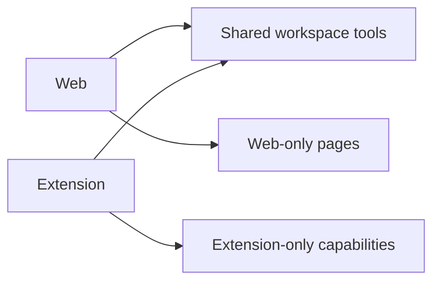
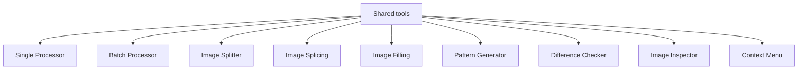
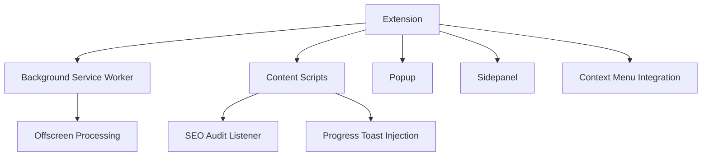
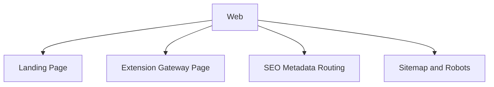

# Feature Platform Matrix (Web vs Extension)

This document lists major product features and where they are available:

- Web app (`apps/web`)
- Browser Extension (`apps/extension`)

Source references:

- `packages/features/src/workspace-shell/workspace-tools.tsx`
- `apps/web/README.md`
- `apps/extension/README.md`

---

## Platform Coverage Diagram

---

## Shared Workspace Tools (Web + Extension)

These tools appear in both platforms:

- Single Processor
- Batch Processor
- Image Splitter
- Image Splicing
- Image Filling
- Pattern Generator
- Difference Checker
- Image Inspector
- Context Menu settings

---

## Extension-Only Feature Branch

Core features only available in extension runtime:

- Context menu conversion actions on webpages
- Background service worker orchestration
- Offscreen processing bridge (`chrome.offscreen`)
- SEO audit listener via content scripts
- Popup command center
- Sidepanel experiences (lite inspector + audit snapshot)
- In-page progress toasts for context-menu conversions

---

## Web-Only Feature Branch

Core features only available in web app runtime:

- Marketing/landing website (`/`)
- Extension gateway page (`/extension`)
- Next.js route metadata / sitemap / robots integration
- Web-first route flows and page SEO behavior

---

## Feature Table

| Feature | Web | Extension | Notes |
|---|---|---|---|
| Single Processor | Yes | Yes | Shared workflow |
| Batch Processor | Yes | Yes | Shared workflow |
| Image Splitter | Yes | Yes | Shared workflow |
| Image Splicing | Yes | Yes | Shared workflow |
| Image Filling | Yes | Yes | Shared workflow |
| Pattern Generator | Yes | Yes | Shared workflow |
| Difference Checker | Yes | Yes | Shared workflow |
| Image Inspector | Yes | Yes | Shared workflow |
| Context Menu settings | Yes | Yes | Web can surface extension info route; extension runs runtime actions |
| SEO Audit runtime scanner | No | Yes | Needs browser page/content-script context |
| Popup app | No | Yes | Extension runtime only |
| Sidepanel app | No | Yes | Extension runtime only |
| Landing / marketing pages | Yes | No | Web site shell only |

---

## How to Maintain This Matrix

When adding/removing a feature:

1. Update `WORKSPACE_TOOLS` in `packages/features/src/workspace-shell/workspace-tools.tsx`.
2. Re-check whether the feature requires browser-extension-only APIs.
3. Update this file’s:
   - shared list
   - extension-only list
   - web-only list
   - feature table

