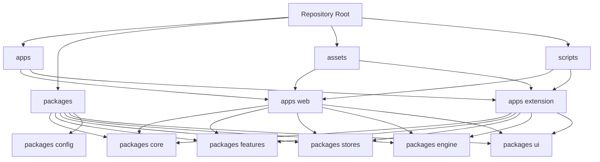
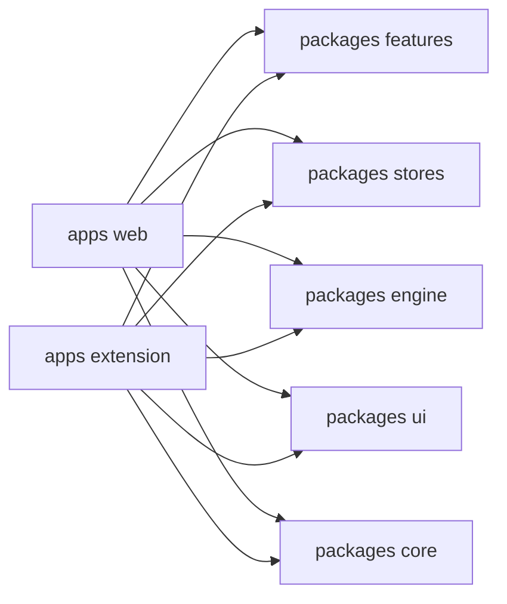

# Repository Architecture (Web + Extension)

This document gives a high-level architecture view of the repository, with two main application branches:

- `apps/web` (Next.js web app)
- `apps/extension` (Plasmo browser extension)

and the shared workspace packages both branches consume.

---

## Monorepo Topology

---

## Shared-First Design

The architecture is intentionally "shared-first":

- Product logic and reusable UI live in `packages/*`.
- Platform apps (`web`, `extension`) compose shared modules and add platform-specific runtime wiring.

This gives:

- consistent behavior across Web and Extension
- less duplicated implementation
- safer fixes (one shared fix reaches both platforms)

---

## Main Branches

### 1) Web Branch (`apps/web`)

- Framework: Next.js App Router (Pure Static Export).
- Responsibility:
  - website routes and workspace pages
  - web shell (header/footer/layout)
  - client-side routing for workspace tool pages (via QueryIdPageGuard)
- Consumes shared modules for:
  - tool workflows
  - state stores
  - conversion logic
  - UI primitives

### 2) Extension Branch (`apps/extension`)

- Framework: Plasmo + React.
- Responsibility:
  - extension options app (main workspace)
  - sidepanel experiences (lite inspector + audit snapshot)
  - background/content script integrations
  - browser-specific permissions and manifest adaptations (e.g., Firefox-specific click behaviors)
- Consumes the same shared modules for:
  - tool workflows
  - stores
  - engine
  - UI components

---

## Shared Package Roles

### `packages/core`

- Cross-cutting domain/constants/helpers.
- Metadata, links, attribution data, shared type contracts, and utilities.

### `packages/features`

- Feature-level UI and business logic shared by Web + Extension.
- Examples:
  - processor/splitter/splicing/pattern/filling flows
  - workspace chrome dialogs (about, settings, attribution, etc.)

### `packages/stores`

- Shared Zustand stores and state contracts.
- Keeps workflow state semantics aligned between platforms.

### `packages/engine`

- Core conversion and processing engine.
- Shared pipeline and worker-compatible processing logic.

### `packages/ui`

- Design-system components and primitives.
- Shared typography, dialogs, inputs, cards, controls.

### `packages/config`

- Shared configuration helpers and presets used across workspace modules.

---

## How Web and Extension Reuse Shared Parts

Practical effect:

- Shared feature modules define the bulk of workflow behavior.
- Web and Extension differ mostly in shell, runtime, and platform adapters.

---

## Assets and Build Orchestration

Shared static assets originate in root `assets/` and are synchronized to both branches by scripts:

- `scripts/sync-shared-assets.mjs`
  - copies into `apps/web/public/assets`
  - copies into `apps/extension/assets`

Command and metadata orchestration scripts are also centralized in root `scripts/`.

---

## Mental Model for Contributors

- If it is platform-agnostic workflow logic -> add to `packages/features`, `packages/stores`, or `packages/engine`.
- If it is shared constants/types/metadata -> add to `packages/core`.
- If it is platform runtime wiring (Next routing, extension manifest/background/content scripts) -> add to `apps/web` or `apps/extension`.

