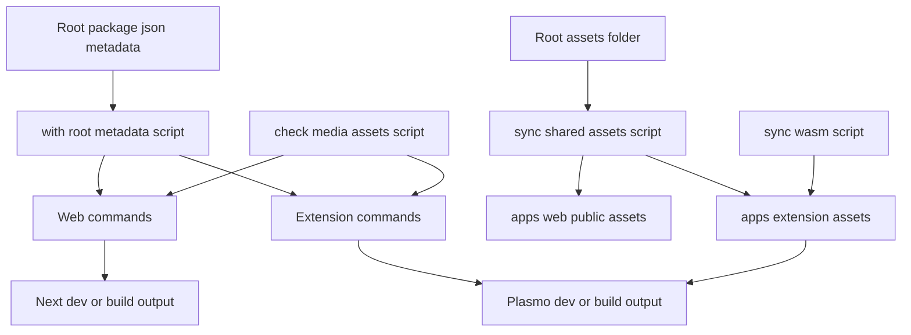

# Dev and Prod Command Flow (Web + Extension)

This document describes what happens when running development and production commands for both `@imify/web` and `@imify/extension`.

It reflects the current script chain in:

- `package.json` (root)
- `apps/web/package.json`
- `apps/extension/package.json`
- `scripts/*.mjs`

---

## Single Source of Truth Metadata

Build/runtime metadata is sourced from root `package.json`:

- `version`
- `imifyMetadata.versionType`
- `imifyMetadata.displayName`

Script `scripts/with-root-metadata.mjs` injects these values into env vars before launching app commands:

- `IMIFY_PUBLIC_VERSION`, `IMIFY_PUBLIC_VERSION_TYPE`, `IMIFY_PUBLIC_APP_NAME`
- `NEXT_PUBLIC_VERSION`, `NEXT_PUBLIC_VERSION_TYPE`, `NEXT_PUBLIC_APP_NAME`
- `PLASMO_PUBLIC_VERSION`, `PLASMO_PUBLIC_VERSION_TYPE`, `PLASMO_PUBLIC_APP_NAME`

This keeps Web and Extension metadata aligned in UI (e.g. About dialog).

---

## System Architecture Diagram



Architecture notes:

- Root `package.json` is metadata source of truth (version + versionType + displayName).
- Root `assets/` is the shared static source, synced into both Web and Extension trees.
- Extension output inclusion is additionally gated by `manifest.web_accessible_resources`.

---

## Root-Level Commands

From repo root:

- `pnpm dev:web` -> runs `pnpm --filter @imify/web dev`
- `pnpm dev:ext` -> runs `pnpm --filter @imify/extension dev`
- `pnpm build:web` -> runs `pnpm --filter @imify/web build`
- `pnpm build:all` -> `turbo build`
- `pnpm typecheck` -> `turbo typecheck`
- `pnpm lint` -> `turbo lint`

---

## Web Flow (`@imify/web`)

### Dev

Command:

```bash
pnpm --filter @imify/web dev
```

Execution chain:

1. `predev` runs automatically:
   - `pnpm sync:assets`
2. `sync:assets`:
   - `pnpm sync:features`
   - `pnpm check:media-assets`
3. `sync:features`:
   - `node ../../scripts/sync-shared-assets.mjs`
   - copies root `assets/**` to:
     - `apps/web/public/assets/**`
     - `apps/extension/assets/**`
4. `check:media-assets`:
   - `node ../../scripts/check-media-asset-paths.mjs`
   - verifies:
     - every logical `/assets/...` path used by `FEATURE_MEDIA_ASSET_PATHS` exists in root and web public
     - extension runtime asset map includes declared tokens
5. Actual dev server starts:
   - `node ../../scripts/with-root-metadata.mjs next dev`

### Prod Build

Command:

```bash
pnpm --filter @imify/web build
```

Execution chain:

1. `prebuild` -> `pnpm sync:assets`
2. asset sync and checks run (same as dev)
3. build:
   - `node ../../scripts/with-root-metadata.mjs next build`
   - **Output**: `apps/web/.next/` (for server) and static exports if configured.

### Prod Start

Command:

```bash
pnpm --filter @imify/web start
```

Runs:

- `node ../../scripts/with-root-metadata.mjs next start`

---

## Extension Flow (`@imify/extension`)

### Dev (generic)

Command:

```bash
pnpm --filter @imify/extension dev
```

Execution chain:

1. `predev` -> `pnpm sync:assets`
2. `sync:assets` runs:
   - `pnpm sync:wasm`
   - `pnpm sync:features`
   - `pnpm check:media-assets`
3. `sync:wasm` (`scripts/sync-wasm.mjs`) sequentially runs:
   - `sync:avif-wasm`
   - `sync:jxl-wasm`
   - `sync:mozjpeg-wasm`
   - `sync:oxipng-wasm`
   - `sync:webp-wasm`
   - `sync:resize-wasm`
4. `sync:features`:
   - `node ../../scripts/sync-shared-assets.mjs`
   - copies root `assets/**` into `apps/extension/assets/**` (and web public mirror)
5. `check:media-assets` validation runs
6. Extension dev server starts with root metadata:
   - `node ../../scripts/with-root-metadata.mjs plasmo dev`
   - **Output**: `apps/extension/build/chrome-mv3-dev/` (default target)

- Chrome MV3:
  ```bash
  pnpm --filter @imify/extension dev:chrome
  ```
  -> `node ../../scripts/with-root-metadata.mjs plasmo dev --target=chrome-mv3`

- Edge MV3:
  ```bash
  pnpm --filter @imify/extension dev:edge
  ```
  -> `node ../../scripts/with-root-metadata.mjs plasmo dev --target=edge-mv3`

- Firefox MV3:
  ```bash
  pnpm --filter @imify/extension dev:firefox
  ```
  -> `node ../../scripts/with-root-metadata.mjs plasmo dev --target=firefox-mv3`

### Prod Build

- Generic:
  ```bash
  pnpm --filter @imify/extension build
  ```
  -> `prebuild` sync chain + `node ../../scripts/with-root-metadata.mjs plasmo build`
  -> **Output**: `apps/extension/build/chrome-mv3-prod/` (default target)

- Chrome:
  ```bash
  pnpm --filter @imify/extension build:chrome
  ```
  -> `node ../../scripts/with-root-metadata.mjs plasmo build --target=chrome-mv3`
  -> **Output**: `apps/extension/build/chrome-mv3-prod/`

- Edge:
  ```bash
  pnpm --filter @imify/extension build:edge
  ```
  -> `node ../../scripts/with-root-metadata.mjs plasmo build --target=edge-mv3`
  -> **Output**: `apps/extension/build/edge-mv3-prod/`

- Firefox:
  ```bash
  pnpm --filter @imify/extension build:firefox
  ```
  -> `node ../../scripts/with-root-metadata.mjs plasmo build --target=firefox-mv3`
  -> `node ../../scripts/sanitize-firefox-manifest.mjs`
  -> **Output**: `apps/extension/build/firefox-mv3-prod/`

### Packaging

- Generic:
  ```bash
  pnpm --filter @imify/extension package
  ```
  -> `prepackage` sync chain + `node ../../scripts/with-root-metadata.mjs plasmo package`
  -> **Output**: `apps/extension/build/chrome-mv3-prod.zip` (default)

- Chrome zip:
  ```bash
  pnpm --filter @imify/extension package:chrome
  ```
  -> `node ../../scripts/with-root-metadata.mjs plasmo build --target=chrome-mv3 --zip`
  -> **Output**: `apps/extension/build/chrome-mv3-prod.zip`

- Edge zip:
  ```bash
  pnpm --filter @imify/extension package:edge
  ```
  -> `node ../../scripts/with-root-metadata.mjs plasmo build --target=edge-mv3 --zip`
  -> **Output**: `apps/extension/build/edge-mv3-prod.zip`

- Firefox zip:
  ```bash
  pnpm --filter @imify/extension package:firefox
  ```
  -> `pnpm build:firefox` + `node ../../scripts/zip-firefox-build.mjs`
  -> **Output**: `apps/extension/build/firefox-mv3-prod.zip`

---

## Assets: What Is Copied vs What Is Bundled

Important distinction:

1. **Copied to source asset folders**
   - by `sync-shared-assets.mjs`
   - into:
     - `apps/extension/assets/**`
     - `apps/web/public/assets/**`

2. **Actually included in extension build output**
   - controlled by extension `manifest.web_accessible_resources`
   - file may exist in `apps/extension/assets` but still be absent from `build/chrome-mv3-dev` unless resource pattern allows it

Current extension manifest allows:

- `assets/wasm/*`
- `assets/WHATS_NEW.md`
- `assets/*.png`
- `assets/images/*`
- `assets/features/*`

---

## Common Troubleshooting

### "Copied successfully" but file missing in `build/chrome-mv3-dev`

Check:

1. file exists in `apps/extension/assets`
2. path is covered by `web_accessible_resources`
3. extension dev/build restarted after manifest changes

### Asset 404 in Web (`/assets/...`)

Check:

1. file exists in root `assets/**`
2. sync ran (`apps/web/public/assets/**` contains file)
3. referenced path matches actual location (especially relative paths in markdown images)

### Parcel warning: `Expected content key ... to exist`

Usually stale Parcel cache in extension dev.

Typical fix:

1. stop dev process
2. clear extension Parcel cache (under `.plasmo/cache/parcel`)
3. restart dev command

---

## Related Files

- `scripts/with-root-metadata.mjs`
- `scripts/sync-shared-assets.mjs`
- `scripts/sync-wasm.mjs`
- `scripts/check-media-asset-paths.mjs`
- `apps/web/package.json`
- `apps/extension/package.json`
- `package.json` (root metadata)

