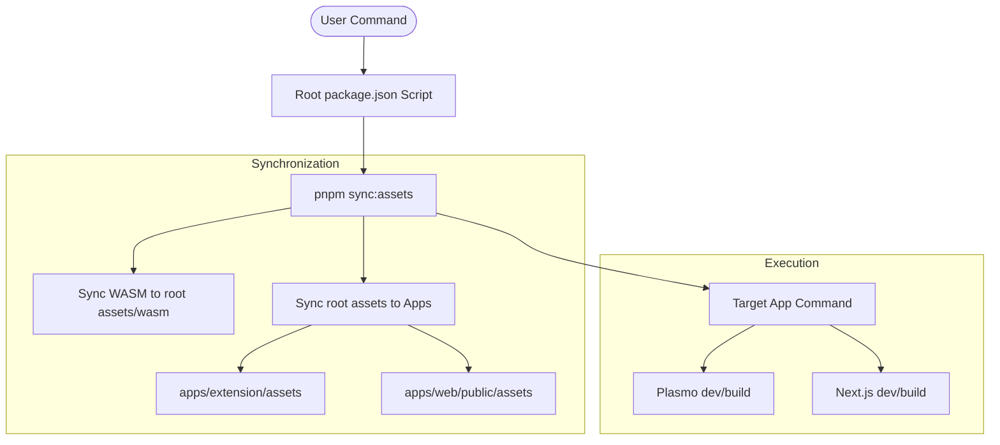

# Dev and Prod Command Flow (Web + Extension)

This document describes the streamlined command flow for the Imify monorepo.

## Single Source of Truth Metadata

Build/runtime metadata is sourced from the root `package.json`:

- `version`: Managed in root, synchronized to all packages via `pnpm sync:package`.
- `imifyMetadata.versionType`: (e.g. "Stable", "Dev")
- `imifyMetadata.displayName`: The public name of the app.
- `imifyMetadata.description`: Shared description across platforms.
- `imifyMetadata.author`: Project author.

### Synchronization Script (`pnpm sync:package`)
Run this manually after updating the version in the root `package.json`. It updates:
- All child `package.json` files in `apps/` and `packages/`.
- Synchronizes metadata for app packages (description, author, displayName).

---

## Command Orchestration

We use a root-level orchestration pattern. All commands follow a "Sync First, Execute Second" rule.

### Orchestration Diagram

---

## Root-Level Commands

| Command | Action |
|---------|--------|
| `pnpm dev` | Starts Turbo Dev for the entire monorepo. |
| `pnpm sync:package` | Syncs version/meta from root to children (Manual). |
| `pnpm sync:assets` | Syncs all shared assets (WASM, Images, MD) to apps. |
| `pnpm dev:web` | `sync:assets` + Next.js dev server. |
| `pnpm dev:chrome` | `sync:assets` + Plasmo dev server (Chrome). |
| `pnpm dev:firefox` | `sync:assets` + Plasmo dev server (Firefox). |
| `pnpm build:web` | `sync:assets` + Next.js static export. |
| `pnpm build:chrome` | `sync:assets` + Plasmo build (Chrome). |
| `pnpm build:firefox` | `sync:assets` + Plasmo build (Firefox) + Sanitation. |
| `pnpm package:all` | `sync:assets` + ZIP all extension variants. |

---

## Detailed Execution Flows

### 1. Unified Asset Sync (`pnpm sync:assets`)
Unlike previous versions where each app had its own `predev` sync, we now run synchronization once from the root:
1. Calls `@imify/extension sync:assets`.
2. This runs `scripts/sync-wasm.mjs` (copies WASM from node_modules to root `assets/wasm`).
3. Runs `scripts/sync-shared-assets.mjs` (copies root `assets/` to both extension and web public folders).
4. Runs `scripts/check-media-asset-paths.mjs` to verify integrity.

### 2. Extension Development (`pnpm dev:chrome` / `pnpm dev:firefox`)
1. Root runs `sync:assets`.
2. Root runs the target extension dev script via `--filter`.
3. Metadata injection via `scripts/with-root-metadata.mjs` sets ENV variables (`PLASMO_PUBLIC_VERSION`, etc.).
4. Plasmo starts with the specific `--target`.

### 3. Web Development (`pnpm dev:web`)
1. Root runs `sync:assets`.
2. Root runs Next.js dev via `--filter`.
3. Metadata injection via `scripts/with-root-metadata.mjs` sets ENV variables (`NEXT_PUBLIC_VERSION`, etc.).

---

## Common Troubleshooting

### Asset 404 / Missing Files
- **Cause**: Assets were not synchronized.
- **Fix**: Run `pnpm sync:assets` manually, or use the root-level `dev:*` commands which include it automatically.

### Version Mismatch in UI
- **Cause**: Root version was bumped but child packages were not updated.
- **Fix**: Run `pnpm sync:package`.

### Firefox Build Failures
- **Cause**: Manifest contains unsupported keys (e.g., `sidePanel`).
- **Fix**: Ensure you use `pnpm build:firefox` or `pnpm package:firefox` which run the `sanitize-firefox-manifest.mjs` script.
