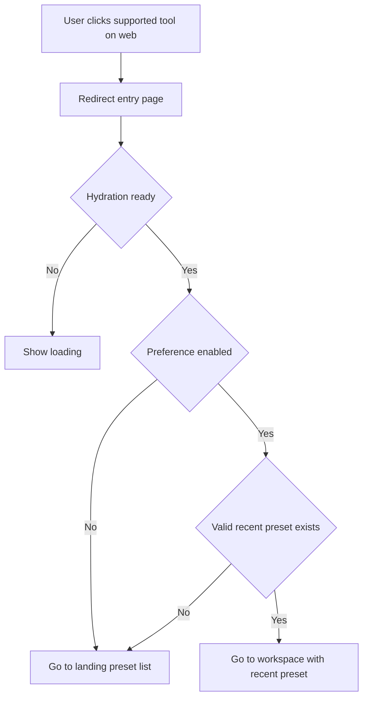
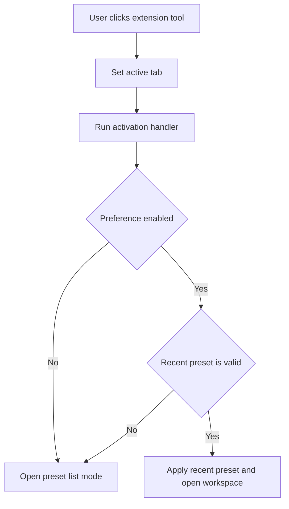

# Prefer Recently Used Preset - Cross-Platform Flow

This document explains how the "Prefer recently used preset" feature works on each platform, why the implementations are intentionally different, and where the shared business rules live.

## Why this file is in `packages/features/docs`

This feature is a cross-platform workspace behavior (Web + Extension) tied to shared tool metadata (`workspace-shell/workspace-tools.tsx`) and shared UX expectations.
Keeping the doc under `docs/` avoids cluttering the package root while still colocating docs with feature owners.

## Scope

Tools covered by this feature:

- `single-processor`
- `batch-processor`
- `splitter`
- `splicing`
- `pattern-generator`

Source of truth for this tool list:

- `packages/features/src/workspace-shell/workspace-tools.tsx` (`PRESET_RECENT_ENTRY_TOOL_IDS`)

## Shared Business Rule

When entering a supported tool:

1. If `preferRecentPresetEntry` is disabled -> open preset list.
2. If enabled but no valid recent preset exists -> open preset list.
3. If enabled and valid recent preset exists -> open workspace with that preset.

A "valid recent preset" means:

- recent ID exists in store, and
- that preset still exists in current preset collection (and context matches for single/batch).

---

## Web Implementation (Next.js)

### Entry Architecture

- Entry points (Home CTA, Home tool grid, Header tools menu) route supported tools to:
  - `/redirect?tool_id=<tool-id>`
- Redirect page:
  - `apps/web/src/app/redirect/page.tsx`
- Mapping helper:
  - `apps/web/src/features/presets/tool-entry-route.ts`

### Why Web uses `/redirect`

- Web navigation is URL-first and must behave correctly with browser history/deep links.
- Separating decision logic into `/redirect` avoids re-triggering auto-open logic when user intentionally returns to list.
- Landing pages stay deterministic (show list), reducing effect-loop risk.

### Web Flow Diagram

---

## Extension Implementation (Options app)

### Entry Architecture

- Extension sidebar changes `activeTab`.
- Decision logic runs in:
  - `apps/extension/src/options/index.tsx`
  - `handleToolTabActivation(nextTab)`
- Preference persistence uses extension sync storage (`useStorage`).

### Why Extension does not use `/redirect`

- Extension workspace is tab-state driven, not route-driven like Web.
- There is no UX need for an intermediate URL route for tab switching.
- State-based activation is simpler and native to Options page architecture.

### Extension Flow Diagram

---

## Platform Comparison

| Topic | Web | Extension |
|---|---|---|
| Entry mechanism | URL navigation | Internal tab state |
| Decision point | `/redirect` page | `handleToolTabActivation` |
| Main concern | history/back behavior, deep-link safety | fast local tab switching |
| List-return safety | landing page has no auto-open logic | tab switch logic can force select/workspace directly |

## Maintenance Notes

- If a new preset-based tool is added, update `PRESET_RECENT_ENTRY_TOOL_IDS` in `workspace-tools.tsx`.
- Web will automatically pick it up via `buildToolEntryHref` (if the tool appears in web entry points).
- Extension requires adding corresponding branch logic in `handleToolTabActivation` if it uses a distinct preset store.
- Keep rule parity across platforms even if implementation details differ.

